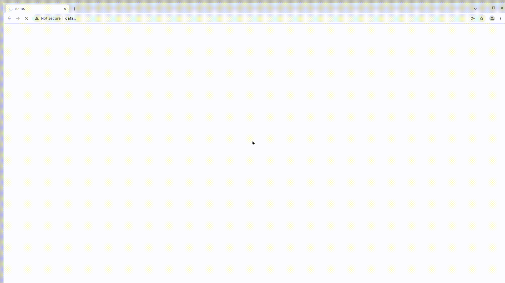

# Проект по автоматизации тестирования сайта МТС :abacus:

## Стек используемых технологий

<p  align="left"

<code></code>
<code></code>
<code></code>
<code></code>
<code></code>
<code></code>
<code></code>
<code></code>
<code></code>
<code></code>
<code></code>
</p>

В данном проекте автотесты написаны на `Java` с использованием `Selenide` для UI-тестов.

`Selenoid выполняет` запуск браузеров в контейнерах `Docker`.

`Allure Report` формирует отчет о запуске тестов.

Для автоматизированной сборки проекта используется `Gradle`.

В качестве библиотеки для модульного тестирования используется `JUnit 5.`

`Jenkins` выполняет запуск тестов. После завершения прогона отправляются уведомления с помощью бота в `Telegram`.
`Allure TestOps` - как система управления тестированием.
##  Запуск тестов из терминала :computer:
###  Локальный запуск тестов
```gradle clean test```
###   Удаленный запуск тестов
 ```
  clean
  ${TASK}
-DremoteUrl=${REMOTE_URL}
-DbrowserSize=${BROWSER_SIZE}
-Dbrowser=${BROWSER}
-DbrowserVersion=${BROWSER_VERSION}
```

###    Параметры сборки
```REMOTE_URL``` – адрес удаленного сервера, на котором будут запускаться тесты.

```BROWSER``` – браузер, в котором будут выполняться тесты (по умолчанию - chrome).

```BROWSER_VERSION``` – версия браузера, в которой будут выполняться тесты (по умолчанию - 91.0).

```BROWSER_SIZE``` – размер окна браузера, в котором будут выполняться тесты (по умолчанию - 1920x1080).
##  Запуск тестов в Jenkins
Для запуска сборки необходимо указать значения параметров и нажать кнопку ```Собрать```.


После завершения сборки результаты тестирования доступны в:
>- <code><strong>*Allure Report*</strong></code>
>- <code><strong>*Allure TestOps*</strong></code> - результаты загружаются туда и тест-кейсы могут автоматически обновляться в соответствии с последними изменениями в коде.

##  Отчет о результатах тестирования в Allure Report :bar_chart:
###  Основной Дашборд ###
Для перехода к просмотру отчета в разделе "История сборок" нажать значок "Allure Report", откроется страница с отчетом по прохождению.


###  Группировка тестов по проверяемому функционалу ###


##  Уведомления в Telegram с использованием бота

После завершения сборки, Вам будет отправлено уведомление в ```Telegram``` с отчетом о прохождении.


##  Интеграция с [Allure TestOps](https://allure.autotests.cloud/launch/18485)
### Основной дашборд

<p align="center">
  
</p>

### Список тестов с результатами прогона

<p align="center">
  
</p>


##  Пример запуска теста в Selenoid :film_strip:

К каждому тесту в отчете прилагается видео. Одно из таких видео представлено ниже.
<p align="center">
  
</p>

